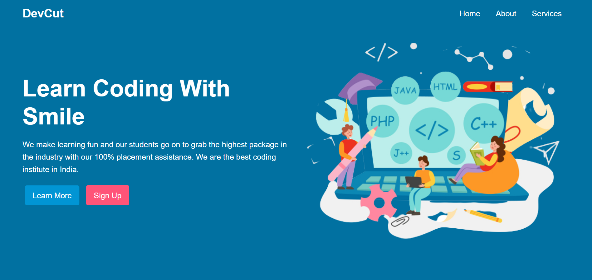

# DevCut - SASS 101 Project

This project is a simple website that uses SASS to style the page. The page is a simple landing page for a fictional company called DevCut. The page is styled using SASS and the SASS files are compiled into CSS files. The page is responsive and uses media queries to adjust the layout for different screen sizes.

> Check out [SASS-101 Guide](guide.md) for a detailed guide on how to use SASS.

### Goals

- Learn the basics of SASS
- Learn how to use SASS features like variables, nesting, partials, mixins, etc.
- Learn how to compile SASS files into CSS files
- Learn how to use media queries to make a responsive website

## Live Demo

[DevCut - SASS 101 Project](https://devcut.netlify.app/)

